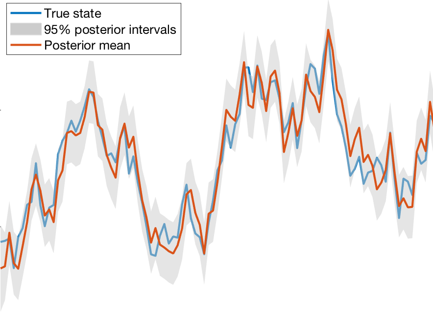
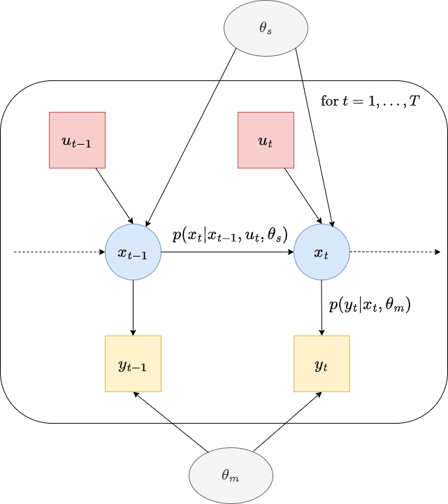

## State-Space Models - a mini-course     

 &nbsp; &nbsp; &nbsp; 

This repo contains material for three lectures on state-space models which used to be part of the Advanced Machine Learning course at Linköping University, Sweden.

The Lab folder contains a computer lab that can be used for examination.